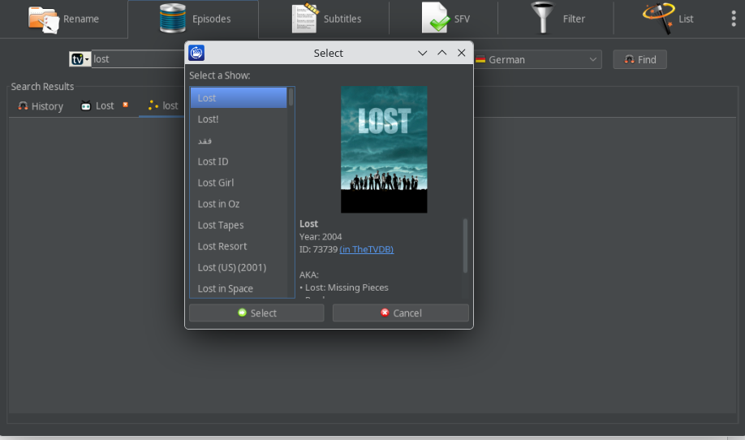

# OpenFileBot

GPL media renamer and organizer for Windows and Linux.

OpenFileBot is based on the latest FileBot source with GPLv3 license.

OpenFileBot helps you batch-rename movies, series episodes, and anime files using online metadata.
It can match files to common naming schemes, move them into clean folder structures, and keep your media library consistent.
For everyday workflows, it also includes subtitle and verification tools available in the interface.

Thanks to the original author and his community, FileBot is a great tool for renaming and organizing media files.

This version does not have the same development power and support as the commercial FileBot.

If you wish good support and a strongly maintained project please use the original FileBot project instead.

[FileBot](https://www.filebot.net/)

If you are fine with basic fixes and updates you are on the right place.

But still if you discover an issue, feel free to open an issue. Attach everything you can find, logs, screenshots what you did and what you expected. If I find some time, i will try to fix it.

Functions and design are currently being revised.

I don't want donations, if somebody tells you you need to pay for OpenFileBot, it's a scam. Not do it!

## Releases

[](https://github.com/masterxq/openfilebot/releases)
[](https://github.com/masterxq/openfilebot/releases/latest)

## Build and Signing

- Local build (unsigned): see [COMPILING.md](COMPILING.md)
- Signing setup (local + CI): see [SIGNING.md](SIGNING.md)

## Installation

### Debian / Ubuntu (`.deb`)

Install local release packages with `apt` so dependencies are resolved automatically:

```bash
sudo apt install ./openfilebot_<version>_<arch>.deb
```

Notes:

- Use `./` (or full path) so `apt` treats it as a local file.
- `apt install ./...deb` resolves and installs missing dependencies from configured repositories.
- `dpkg -i ...deb` alone does not resolve dependencies automatically.

### Debian / Ubuntu (APT Repository)

Signed APT repository:

- `https://masterxq.github.io/openfilebot-repo/apt`

Add key + source (`stable` channel):

```bash
sudo mkdir -p /etc/apt/keyrings
curl -fsSL https://masterxq.github.io/openfilebot-repo/apt/keyrings/openfilebot-archive-keyring.gpg \
	| sudo tee /etc/apt/keyrings/openfilebot-archive-keyring.gpg >/dev/null

echo "deb [signed-by=/etc/apt/keyrings/openfilebot-archive-keyring.gpg] https://masterxq.github.io/openfilebot-repo/apt stable main" \
	| sudo tee /etc/apt/sources.list.d/openfilebot.list >/dev/null

sudo apt update
sudo apt install openfilebot
```

Testing channel:

```bash
echo "deb [signed-by=/etc/apt/keyrings/openfilebot-archive-keyring.gpg] https://masterxq.github.io/openfilebot-repo/apt testing main" \
	| sudo tee /etc/apt/sources.list.d/openfilebot.list >/dev/null
```


## Screenshots




## Pipeline Platform Support

Portable packages:

- Linux `aarch64`: `*-portable-linux-aarch64.tar.gz`
- Linux `x86_64`: `*-portable-linux-x86_64.tar.gz`
- Windows `x64`: `*-portable-win64.zip`

Installer packages (from current pipeline):

- Debian package (`.deb`) is built on `ubuntu-latest`.
- Windows installer (`.msi`) is built on `windows-latest` in the manual release workflow.
- Based on the current workflow runners, the practical installer targets are:

- Debian `amd64`, `i386`, `armhf`
- Windows `x64`
