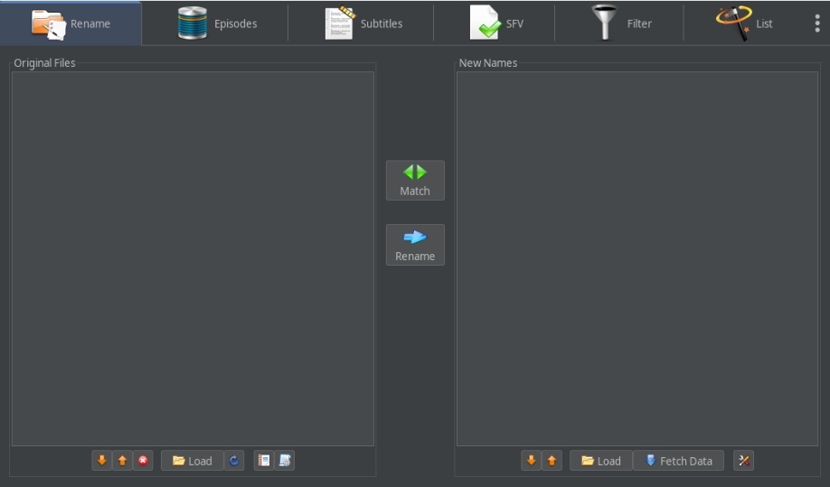

# OpenFileBot

OpenFileBot is a fork of the latest FileBot release with GPLv3 license i could find.

Thanks to the original author and his community, FileBot is a great tool for renaming and organizing media files.

This fork will be maintained with low power and the support will be very limited.
So if you wish good support and a strongly maintained project please use the original FileBot project instead.

[FileBot](https://www.filebot.net/)

If you are fine with basic fixes and updates you are on the right place.

Functions and design are currently being revised.

I don't want donations, if somebody tells you you need to pay for OpenFileBot, it's a scam. Not do it!

## Releases


## Build and Signing

- Local build (unsigned): see [COMPILING.md](COMPILING.md)
- Signing setup (local + CI): see [SIGNING.md](SIGNING.md)

## Installation

### Debian / Ubuntu (`.deb`)

Install local release packages with `apt` so dependencies are resolved automatically:

```bash
sudo apt install ./openfilebot_<version>_<arch>.deb
```

Notes:

- Use `./` (or full path) so `apt` treats it as a local file.
- `apt install ./...deb` resolves and installs missing dependencies from configured repositories.
- `dpkg -i ...deb` alone does not resolve dependencies automatically.

## Screenshots




## Pipeline Platform Support

Portable packages:

- Built in CI on Linux (`ubuntu-latest`) and in manual release workflow.
- Linux `aarch64`: `*-portable-linux-aarch64.tar.gz`
- Linux `x86_64`: `*-portable-linux-x86_64.tar.gz`
- Windows `x64`: `*-portable-win64.zip`

Installer packages (from current pipeline):

- Debian package (`.deb`) is built on `ubuntu-latest`.
- Windows installer (`.msi`) is built on `windows-latest` in the manual release workflow.
- Based on the current workflow runners, the practical installer targets are:

- Debian `amd64`, `i386`, `armhf`
- Windows `x64`
